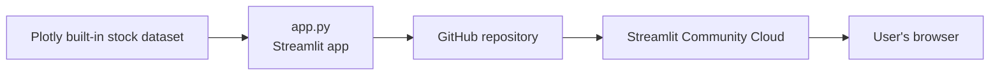

# Stock Explorer

A Streamlit app for exploring and comparing normalized stock price growth, with a "what if I invested $1,000?" calculator.

**Live app:** https://mivsekstocks.streamlit.app/

## Architecture



## Running locally

```bash
pip install -r requirements.txt
streamlit run app.py
```
